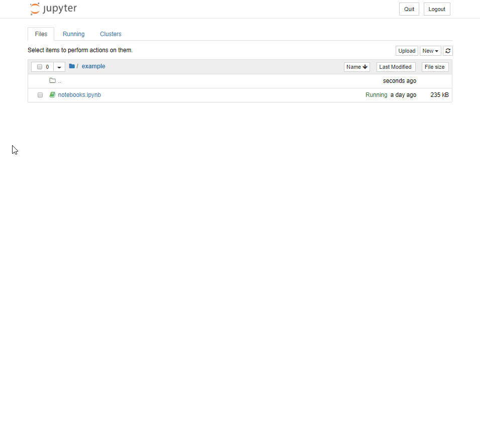

# nbreport

[](https://mybinder.org/v2/gh/choldgraf/nbreport/master?filepath=example%2F)

Quick generate HTML reports from your Jupyter Notebooks.

This is a lightweight Jupyter plugin that gives you the option to download
a report from the Jupyter Notebook interface. Upon installing, you get a
new button in the `Download as` section that, when clicked, does the following
things:

1. Removes all empty cells
2. Removes any cells with `hide_cell` in the tags
3. Removes the code of any cells with `hide_code` in the tags
4. Clears the `stderr` output
5. Clears the input / output numbers
6. Adds author / title information to the top of the page
6. Outputs the notebook as a single HTML file that can be
   opened in the browser.



`nbreport` uses another lightweight tool called [nbclean](https://github.com/choldgraf/nbclean)
in order to accomplish the above, along with a simple template designed
for [nbconvert](https://github.com/jupyter/nbconvert).

## Installation

To install `nbreport`, first clone this repository to your computer, then run

```
pip install -e nbreport/
```

Finally, activate `nbreport` on your Jupyter environment with the following command:

```
jupyter bundlerextension enable --py nbreport --sys-prefix
```

## Usage

There are two primary ways to use `nbreport`:

* **As a command-line tool**. You can invoke `nbreport` from the command line with the
  following command:

  ```
  nbreport path/to/notebook.ipynb
  ```
  
  It will output the HTML file in the same directory as the notebook you used as input.

* **From the Jupyter Notebook interface**. From a live Notebook, you can convert the
  current notebook to an HTML report by following clicking on `File --> Download As --> NBReport`.
  The HTML will be created in the same folder as the notebook you've opened.

## Command-line options

You can expand the functionality of `nbreport` with a few extra command-line options. For
example, the `--css` parameter allows you to include arbitrary extra CSS files with your built
HTML, allowing you to style it however you like.